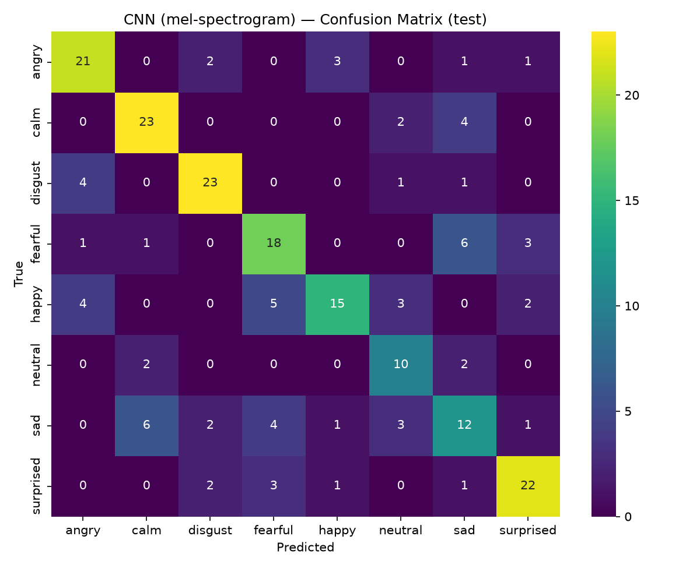
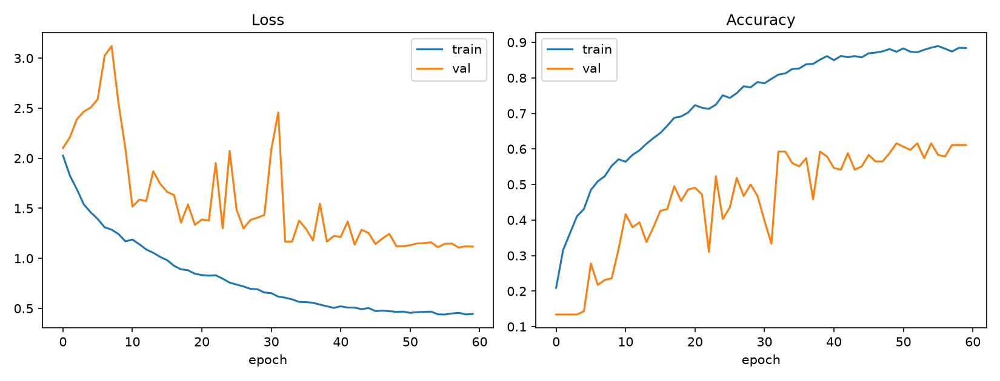

# EmotionSense — Speech Emotion Recognition

## 1. Why I built this

Two people can say "I'm fine" and mean completely opposite things. The words are identical; the
voice underneath them isn't. Anything that only reads a transcript — a support-ticket system, a
game character, a journaling app — misses that entirely. Speech Emotion Recognition tries to
predict the emotion behind an utterance from the sound itself: pitch, energy, rhythm, timbre —
not what was said, but how.

That's the piece I wanted to actually build, not just read about: take raw audio in, get a
believable emotion label out, and be honest in the write-up below about where it works and where
it doesn't.

## 2. Dataset & preprocessing

**[RAVDESS](https://zenodo.org/records/1188976)** (Ryerson Audio-Visual Database of Emotional
Speech and Song), audio-only speech subset: 24 professional actors (12 male, 12 female), each
reading two lexically-matched statements across 8 emotions at two intensities (except neutral,
which has no "strong" variant), 1,440 clips total.

- **Label parsing**: RAVDESS encodes everything in the filename
  (`modality-vocalChannel-emotion-intensity-statement-repetition-actor.wav`) — no separate label
  file needed, see `ml/data_prep.py`.
- **Class balance**: every emotion has 192 clips except neutral (96, since it has no strong-intensity
  variant) — a 2:1 imbalance, handled via `class_weight="balanced"` (classical models) and
  class-weighted loss (CNN) rather than oversampling, so we don't duplicate short utterances into
  the training set.
- **Split**: stratified 70/15/15 train/val/test on emotion label (`sklearn.train_test_split`,
  stratify=emotion, twice) — every split keeps each emotion's proportion within ~0.5pp of the
  full dataset.
- **Audio normalization**: every clip is trimmed of leading/trailing silence (`librosa.effects.trim`,
  top_db=25) then padded/truncated to a fixed 3.5s window at 22.05kHz, so every feature vector and
  spectrogram has a consistent shape regardless of the source clip's original length.

## 3. Feature extraction

Per clip (`ml/audio_features.py`, `ml/feature_extraction.py`):

| Feature | What it captures | Dimensionality |
|---|---|---|
| MFCC (40 coefficients) | Timbre / vocal-tract shape | 40 × (mean, std) = 80 |
| Chroma STFT | Pitch-class content | 12 × (mean, std) = 24 |
| Mel spectrogram | Frequency-energy distribution | mean/std + 16 coarse bands = 18 |
| Zero-crossing rate | Voiced vs. unvoiced / noisiness | mean, std = 2 |
| RMS energy | Loudness (separates high/low-arousal emotions) | mean, std = 2 |

→ 126-dimensional feature vector for the classical models, cached to
`data/processed/features_classical.pkl` (+ `.csv`) so it's computed once, not on every run.

For the CNN, each clip additionally gets a fixed-shape (128 mel bands × 151 frames) log-mel
spectrogram "image", min-max normalized per clip, cached to
`data/processed/spectrograms_{train,val,test}.npz`.

## 4. Model architectures

### Baseline (classical ML) — `ml/train_baseline.py`

Random Forest and SVM on the 126-d classical feature vector, both tuned with real
`GridSearchCV` (5-fold, scored on macro-F1 so the minority "neutral" class isn't ignored):

- **Random Forest**: grid over `n_estimators` (200/400/600), `max_depth` (None/15/30),
  `min_samples_split` (2/4)
- **SVM**: grid over `C` (0.1/1/10/100), `kernel` (rbf/linear), `gamma` (scale/auto)

Why start here: classical models on hand-crafted features are fast to train, easy to inspect
(feature importances, support vectors), and set an honest floor — if the CNN can't beat this, the
extra complexity isn't worth it.

### Deep learning — `ml/train_deep.py` (Option A: CNN on mel-spectrograms)

Treats each clip's log-mel spectrogram as a 2D image:

```
Conv2D(32) → BatchNorm → MaxPool
Conv2D(64) → BatchNorm → MaxPool
Conv2D(128) → BatchNorm → MaxPool
GlobalAveragePooling2D
Dense(128, relu) → Dropout(0.4)
Dense(8, softmax)
```

`GlobalAveragePooling2D` instead of `Flatten` is a deliberate choice: flattening the last conv
block's output would hand ~37k values to the first dense layer (9M+ parameters on ~2k training
clips — instant overfitting, exploding validation loss, which is exactly what the first training
attempt did before this fix). GAP collapses each feature map to one number first, dropping the
model to ~110k parameters, appropriate for a dataset this size.

**Augmentation** (`ml/augment_train.py`, training split only): one randomly pitch-shifted,
time-stretched, or noise-injected copy per training clip, doubling the effective training set.
Validation/test spectrograms are never augmented.

**Regularization**: Dropout(0.4), `class_weight="balanced"`, `EarlyStopping` (patience 10 on
val_loss, restores best weights), `ReduceLROnPlateau`.

## 5. Results

Test set: 216 held-out clips (the 15% test split), never seen during training or hyperparameter
selection for any model.

| Model | Test Accuracy | Test Macro-F1 | Best hyperparameters |
|---|---|---|---|
| Random Forest (baseline) | 58.3% | 0.572 | `n_estimators=200, max_depth=None, min_samples_split=4` |
| SVM (baseline) | 58.3% | 0.564 | `C=1, kernel=rbf, gamma=auto` |
| **CNN (deep learning)** | **66.7%** | **0.661** | 60 epochs, augmented training set, GAP head |

The CNN beats both classical baselines by ~8.4 points of accuracy and ~0.09 macro-F1 — a real,
if modest, gain from letting a convolutional network learn its own representation of the
spectrogram instead of relying on hand-summarized statistics. Per-class F1 (`per_class_metrics.csv`):

| Emotion | RF F1 | SVM F1 | CNN F1 |
|---|---|---|---|
| Angry | 0.596 | 0.755 | 0.724 |
| Calm | 0.698 | 0.618 | 0.754 |
| Disgust | 0.603 | 0.708 | 0.793 |
| Fearful | 0.644 | 0.618 | 0.610 |
| Happy | 0.383 | 0.250 | 0.612 |
| Neutral | 0.471 | 0.440 | 0.606 |
| Sad | 0.436 | 0.444 | 0.429 |
| Surprised | 0.741 | 0.679 | 0.759 |

"Happy" is where the CNN's advantage shows up most (F1 0.61 vs. 0.38/0.25 for the baselines) — the
spectrogram evidently carries happy/angry-distinguishing detail that the 126-d hand-crafted
feature vector was smoothing away. "Sad" stays the hardest class for every model, discussed below.



Full classification reports, per-class precision/recall/F1, and confusion matrices for all three
models are in `docs/results/` (generated by `ml/evaluate.py`):

- `confusion_matrix_rf.png`, `confusion_matrix_svm.png`, `confusion_matrix_cnn.png`
- `rf_classification_report.txt`, `svm_classification_report.txt`, `cnn_classification_report.txt`
- `per_class_metrics.csv`, `comparison_table.md`
- `cnn_training_curves.png` (loss/accuracy over epochs, below)



The CNN trained for the full 60 epochs without early-stopping ever triggering (val_loss kept
finding new lows, most recently at epoch 58) — `ReduceLROnPlateau` stepping the learning rate
down four times (5e-4 → ~7.8e-6) is doing a lot of the later-epoch improvement. A longer run or a
lower floor on the LR schedule would be the first thing to try for more accuracy.

**Measured backend latency**: the backend now serves from the TFLite model (see "Model serving"
below) rather than the full Keras model — measured locally, ~30ms per request steady-state, model
load at startup ~6.4s. (An earlier version served the full Keras model directly: ~110ms/request,
but ~57s startup and a memory footprint that OOM-crashed on Render's 512MB free tier the moment a
real request ran — see below for why that changed.)

**A second, separate cold-start trap, found the same way (against the live deployment, not just
in theory)**: even after the memory fix, the *first* real inference call after a fresh process
start took ~40-64s — comfortably over Render's request timeout, so it 502'd every time despite
`/health` responding instantly. Root cause: librosa's audio-processing internals are numba-JIT-
compiled on first use, a one-time cost that's easy to miss locally (a fast dev machine hides it;
~40s there became a timeout-triggering 50-64s on Render's slower/throttled free CPU) and that
recurs on every free-tier idle-spindown-then-wake cycle, since the JIT cache doesn't survive a
process restart. Fix: `EmotionPredictor.warm_up()` runs one throwaway inference through every
loaded backend during the FastAPI startup `lifespan` handler (`backend/main.py`), before Render's
health check ever sees the container as ready - measured locally, that moves the ~29s one-time
cost from a real user's first request (where it caused a 502) to server boot (where nobody's
waiting on it): first real `/predict` after startup dropped from 40-64s to **0.28s**.

**A third bug, this one architectural, not a cold-start cost**: `/predict` was declared `async def`
but called the blocking, CPU-heavy `predictor.predict_from_path()` directly inside it. FastAPI
only runs plain `def` endpoints in a thread pool automatically - an `async def` endpoint that does
blocking work runs it straight on the event loop, freezing the *entire* server (every other
request, including `/health`) for that call's full duration. On a single-worker free-tier
instance, this plausibly explains why Render's own health checks flapped during real traffic: a
slow prediction could make `/health` itself briefly unresponsive, which looks identical to a crash
from Render's side. Fix: wrap the blocking call in `fastapi.concurrency.run_in_threadpool`
(`backend/main.py`, both `/predict` and `/predict-live`). Verified with a concurrency test - fired
one real `/predict` request and hammered `/health` five times while it was in flight: all five
returned in 2-11ms, unaffected by the concurrent prediction (previously they'd have queued behind
it).

### Where the models get confused

Reading the confusion matrices (`confusion_matrix_{rf,svm,cnn}.png`) side by side, the same two
mix-ups show up in every model, which is a stronger signal than any one model's quirks:

- **Calm ↔ Sad** is the largest confusion pair across the board — 10 of 216 test clips crossed
  between these two for both the Random Forest and the CNN (e.g. CNN: 6 true-sad clips predicted
  calm, 4 true-calm predicted sad). Both emotions are low-arousal, low-pitch-variance speech;
  acoustically they're genuinely close, and disambiguating them reliably would need lexical
  content or longer context, not just prosody.
- **Angry ↔ Happy** is the second-largest confusion (7 of 216 for the CNN) — both are high-arousal,
  high-energy delivery, so a model reading energy/pitch-variance alone can flip between them.
  This is exactly where the CNN's spectrogram-level detail helps most: its happy-class F1 (0.61)
  roughly doubles the SVM's (0.25), because *how* the energy is shaped over time (not just how much
  of it there is) turns out to matter.
- **Sad** is the single hardest class for every model (F1 0.42-0.44 across all three) — it's the
  class most likely to be confused with something else rather than confidently correct.

These are documented here rather than hidden because a demo that only shows its best confusion
matrix is misleading; a real integration should treat calm/sad and angry/happy as a known soft
boundary, not a bug.

### Sanity test on out-of-dataset clips

`ml/sanity_test.py` runs the trained predictor against edge cases a real deployment has to
survive gracefully — pure silence, a 0.15s blip, a near-silent whisper-level clip, a bare tone —
plus a random sample of held-out RAVDESS clips (5/5 correct on the run that produced these
numbers). Results, and what they actually show:

- **Pure silence and the 0.15s blip are correctly rejected** with a clear error message
  (`ml/predict.py`'s `MIN_RMS_ENERGY` / `MIN_DURATION_SEC` checks) instead of a wrong-but-confident
  answer.
- **A near-silent noise clip (RMS just above the threshold) was *not* rejected**, and the model
  returned "disgust" at 99.99% confidence on what is, acoustically, nothing. The energy-gate
  catches true silence but doesn't guarantee the audio above it is meaningful speech — a real
  deployment facing unpredictable microphone input should treat very-low-confidence-adjacent *and*
  very-high-confidence-on-suspiciously-clean-noise as both worth a second look, not just low
  confidence alone.
- **A pure 220Hz tone was classified "sad" at 84% confidence.** The model has no explicit
  "not speech" detector — it's a closed 8-way classifier, so any input gets forced into one of the
  eight buckets. Don't feed it non-speech audio and trust the label; that's a gap worth closing
  (e.g. a lightweight voice-activity/speech-vs-non-speech check) before any production use.

These aren't hypothetical caveats — they're what this exact pipeline actually did when asked.

**A real accuracy bug, found from actual phone usage, not a benchmark**: `load_fixed_length`
(used at training time) always takes the *first* 3.5 seconds of a trimmed clip. RAVDESS clips are
already ~3-4s, so that was never a problem for training or for the 66.7% number above. But a
person talking into their phone routinely runs past 3.5s — a "um, okay" or a breath at the start,
then the actual sentence a couple seconds in — and blindly using the first 3.5s can crop out the
part that actually carries the emotion. Fixed at the inference layer only (`select_best_window` in
`ml/audio_features.py`, wired into `predict_from_path`/`predict_from_array` in `ml/predict.py`):
slide a window across the clip and keep whichever 3.5s span has the highest RMS energy, instead of
always the start. Training code is untouched, so the 66.7% figure above still stands unchanged.

Measured, not assumed: took a real test clip (ground truth "happy"), padded it with 4s of low-level
noise beforehand, and ran it through both paths. The clip alone was already a close, uncertain call
(34.7% "disgust", "happy" a close second) - a real acoustic ambiguity in this file, not something
the windowing fix claims to solve. But burying that same clip in noise and picking the best window
found the actual speech and returned "happy" at 99.9997% confidence - the correct answer, and far
more confident than the plain short clip ever was. Re-ran 40 random held-out test clips through the
new code path afterward to confirm no regression: 60% (24/40), consistent with the documented
66.7% within normal sampling noise for a 40-clip subset of the 216-clip test set.

## 6. Local setup

See the root [README.md](../README.md#quick-start) for the full pipeline commands. Short version:

```bash
cd ml && pip install -r requirements.txt
python data_prep.py && python feature_extraction.py && python augment_train.py
python train_baseline.py && python train_deep.py && python evaluate.py
```

Then either:

```bash
cd backend && pip install -r requirements.txt && uvicorn main:app --reload
```

or open `website/index.html` directly, or `cd mobile && npm install && npx expo start`.

## 7. Deployment

- **Backend**: `backend/Dockerfile` + root-level `render.yaml` deploy to Render as a Docker web
  service (Railway works the same way pointed at the same Dockerfile). `/health` is wired up as
  the platform health-check path. Full step-by-step in [docs/DEPLOYMENT.md](DEPLOYMENT.md).
- **Model size / serving runtime — this bit isn't optional on free tier.** `ml/quantize_model.py`
  exports a dynamic-range-quantized TFLite version of the CNN (**1.40MB → 0.12MB, 11.2x smaller**,
  **66.7% → 63.4%** test-accuracy trade-off — `docs/results/quantization_results.json`). The
  smaller *file* isn't the point that matters most, though: `backend/main.py` was originally built
  to `import tensorflow` and load `cnn_model.keras` directly, and that broke a real deployment —
  full `tensorflow-cpu` is a ~1.5GB installed package, and importing it plus running one real
  inference request pushed the process over Render's 512MB free-tier RAM cap, which OOM-crashed
  the container (visible as `/health` working fine, then a platform 502 the moment `/predict` ran
  for real). The fix, now in `ml/predict.py`: serve from `cnn_model.tflite` via `ai_edge_litert`
  (a standalone ~47MB interpreter-only package, no TensorFlow import at all) instead of the full
  Keras model — see `backend/requirements.txt`. Verified in a clean venv with `tensorflow` not
  even installed: ~6.4s model load (vs. ~57s), ~30ms/request steady-state (vs. ~110ms), flat
  memory across repeated requests. `train_deep.py`/`evaluate.py` still use full `tensorflow-cpu`
  for training — this swap is serving-only.
- **Model artifacts**: `ml/models/` (~12MB total) is committed to the repo, so `backend/` runs
  immediately after `pip install` with no retraining step. If the models grow past what you want
  in git (e.g. after retraining on a larger dataset), switch to pulling them from a release,
  HuggingFace Hub, or S3 bucket at container startup instead.

## 8. Demo

No hosted deployment yet — this build was developed and evaluated locally end-to-end (see
Results above for real measured numbers, not projections). To stand up a live demo:

1. Deploy `backend/` to Render using the root `render.yaml` (or any Docker host) and note the URL.
2. Point `mobile/app.json`'s `extra.apiUrl` (or `EXPO_PUBLIC_API_URL`) and set the same URL for the
   website's "Start Dialogue" flow.
3. Publish `website/index.html` to any static host (Netlify, Vercel, GitHub Pages, S3) — it has no
   build step and no external requests.
